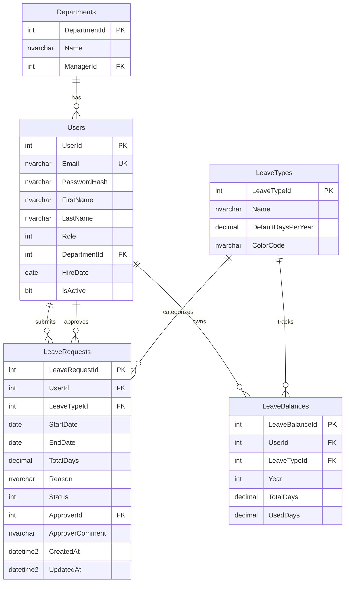

# Mini Leave Management System — System Design

> ระบบจัดการการลาของพนักงาน (เลียนแบบ feature ย่อยของ empeo)
> Portfolio project สำหรับสมัครฝึกงาน Gofive — โฟกัส stack ที่บริษัทใช้จริง

---

## 1. Objective

จำลอง core feature ของ HR SaaS: **ยื่นใบลา → หัวหน้าอนุมัติ → ตัดวันลาอัตโนมัติ**
จุดขายที่ต่างจาก CRUD ทั่วไป: มี **approval workflow** + **role-based access** + **business rule** (ตัดโควต้าวันลา) ซึ่งสะท้อนงาน B2B SaaS จริง

## 2. Tech Stack

| Layer    | Technology            | เหตุผล                  |
| -------- | --------------------- | ----------------------- |
| Backend  | .NET 8 Web API (C#)   | ตรง stack Gofive        |
| ORM      | Entity Framework Core | มาตรฐาน .NET            |
| Database | SQL Server            | ตรง stack Gofive        |
| Frontend | Angular + TypeScript  | ตรง stack Gofive        |
| Auth     | JWT (Bearer Token)    | role-based              |
| Docs     | Swagger / OpenAPI     | โชว์ API ได้สวยตอน demo |

---

## 3. Roles & User Stories

### Employee

- ดูวันลาคงเหลือแยกตามประเภท (ป่วย / กิจ / พักร้อน)
- ยื่นใบลา (เลือกประเภท, ช่วงวันที่, เหตุผล)
- ดูประวัติคำขอของตัวเอง + สถานะ
- ยกเลิกคำขอที่ยัง Pending

### Manager

- ดูคำขอลาของลูกทีม (เฉพาะ department ตัวเอง)
- อนุมัติ / ปฏิเสธ พร้อมใส่ comment
- เมื่ออนุมัติ → ระบบตัดวันลาอัตโนมัติ
- Dashboard สรุปจำนวนคำขอ Pending

> ขอบเขตตั้งใจให้เล็ก: ไม่ทำ payroll, ไม่ทำ shift, ไม่ทำ multi-level approval — โฟกัสให้ flow เดียวสมบูรณ์

---

## 4. Architecture (Layered)

```
Angular SPA
    │  HTTP + JWT
    ▼
Controller Layer      ← รับ request, validate, return DTO
    ▼
Service Layer         ← business logic (ตัดวันลา, เช็คสิทธิ์, workflow)
    ▼
Repository Layer      ← EF Core, query DB
    ▼
SQL Server
```

**ทำไมต้องแยกชั้น:** Gofive ทำ SaaS ที่ codebase ใหญ่และ organize เป็นชั้น การแยก Controller/Service/Repository แสดงว่าเข้าใจ separation of concerns ไม่ได้ยัด logic ใน controller

---

## 5. Folder Structure

### Backend (`/api`)

```
LeaveManagement.Api/
├── Controllers/
│   ├── AuthController.cs
│   ├── LeaveRequestsController.cs
│   └── LeaveBalancesController.cs
├── Services/
│   ├── Interfaces/
│   │   ├── ILeaveRequestService.cs
│   │   └── IAuthService.cs
│   ├── LeaveRequestService.cs
│   └── AuthService.cs
├── Repositories/
│   ├── Interfaces/
│   └── LeaveRequestRepository.cs
├── Models/
│   ├── Entities/          # EF entities (ตรงกับ DB)
│   └── DTOs/              # request/response objects
├── Data/
│   └── AppDbContext.cs
├── Migrations/
├── Helpers/              # JWT, mapping
├── appsettings.json
└── Program.cs
```

### Frontend (`/web`)

```
src/app/
├── core/                 # auth guard, interceptor, services
├── features/
│   ├── auth/             # login
│   ├── leave-request/    # ฟอร์มยื่นลา + ประวัติ
│   ├── approval/         # หน้า manager อนุมัติ
│   └── dashboard/        # สรุปวันลา
├── shared/               # components ใช้ซ้ำ
└── models/               # interface ตรงกับ DTO
```

---

## 6. Database Design

### 6.1 ER Diagram



### 6.2 Table Specifications

**Departments** — แผนก แต่ละแผนกมีหัวหน้า 1 คน
| Column | Type | Note |
|---|---|---|
| DepartmentId | INT, PK, IDENTITY | |
| Name | NVARCHAR(100) | ไม่ซ้ำ |
| ManagerId | INT, FK→Users, NULL | หัวหน้าแผนก |

**Users** — พนักงานทุกคน (รวม manager)
| Column | Type | Note |
|---|---|---|
| UserId | INT, PK, IDENTITY | |
| Email | NVARCHAR(256), UNIQUE | ใช้ login |
| PasswordHash | NVARCHAR(MAX) | BCrypt |
| FirstName / LastName | NVARCHAR(100) | |
| Role | INT | 0=Employee, 1=Manager, 2=Admin |
| DepartmentId | INT, FK→Departments | |
| HireDate | DATE | |
| IsActive | BIT | default 1 |

**LeaveTypes** — ประเภทการลา (master data)
| Column | Type | Note |
|---|---|---|
| LeaveTypeId | INT, PK, IDENTITY | |
| Name | NVARCHAR(50) | ลาป่วย/ลากิจ/ลาพักร้อน |
| DefaultDaysPerYear | DECIMAL(5,1) | โควต้าเริ่มต้น/ปี |
| ColorCode | NVARCHAR(7) | สำหรับ UI เช่น #FF5A5A |

**LeaveBalances** — โควต้าวันลาของแต่ละคน แยกตามปี+ประเภท
| Column | Type | Note |
|---|---|---|
| LeaveBalanceId | INT, PK, IDENTITY | |
| UserId | INT, FK→Users | |
| LeaveTypeId | INT, FK→LeaveTypes | |
| Year | INT | เช่น 2026 |
| TotalDays | DECIMAL(5,1) | โควต้าทั้งหมด |
| UsedDays | DECIMAL(5,1) | ใช้ไปแล้ว default 0 |

> RemainingDays = TotalDays − UsedDays (คำนวณใน service ไม่เก็บใน DB เพื่อกัน data ไม่ตรงกัน)
> UNIQUE constraint: (UserId, LeaveTypeId, Year) กันโควต้าซ้ำ

**LeaveRequests** — ใบลา (transaction หลัก)
| Column | Type | Note |
|---|---|---|
| LeaveRequestId | INT, PK, IDENTITY | |
| UserId | INT, FK→Users | คนยื่น |
| LeaveTypeId | INT, FK→LeaveTypes | |
| StartDate / EndDate | DATE | |
| TotalDays | DECIMAL(5,1) | คำนวณตอนยื่น |
| Reason | NVARCHAR(500) | |
| Status | INT | 0=Pending, 1=Approved, 2=Rejected, 3=Cancelled |
| ApproverId | INT, FK→Users, NULL | คนอนุมัติ |
| ApproverComment | NVARCHAR(500), NULL | |
| CreatedAt / UpdatedAt | DATETIME2 | |

### 6.3 DDL (SQL Server)

```sql
CREATE TABLE Departments (
    DepartmentId INT IDENTITY(1,1) PRIMARY KEY,
    Name NVARCHAR(100) NOT NULL UNIQUE,
    ManagerId INT NULL
);

CREATE TABLE Users (
    UserId INT IDENTITY(1,1) PRIMARY KEY,
    Email NVARCHAR(256) NOT NULL UNIQUE,
    PasswordHash NVARCHAR(MAX) NOT NULL,
    FirstName NVARCHAR(100) NOT NULL,
    LastName NVARCHAR(100) NOT NULL,
    Role INT NOT NULL DEFAULT 0,
    DepartmentId INT NULL,
    HireDate DATE NOT NULL,
    IsActive BIT NOT NULL DEFAULT 1,
    CONSTRAINT FK_Users_Dept FOREIGN KEY (DepartmentId)
        REFERENCES Departments(DepartmentId)
);

ALTER TABLE Departments
    ADD CONSTRAINT FK_Dept_Manager FOREIGN KEY (ManagerId)
        REFERENCES Users(UserId);

CREATE TABLE LeaveTypes (
    LeaveTypeId INT IDENTITY(1,1) PRIMARY KEY,
    Name NVARCHAR(50) NOT NULL,
    DefaultDaysPerYear DECIMAL(5,1) NOT NULL,
    ColorCode NVARCHAR(7) NULL
);

CREATE TABLE LeaveBalances (
    LeaveBalanceId INT IDENTITY(1,1) PRIMARY KEY,
    UserId INT NOT NULL,
    LeaveTypeId INT NOT NULL,
    [Year] INT NOT NULL,
    TotalDays DECIMAL(5,1) NOT NULL,
    UsedDays DECIMAL(5,1) NOT NULL DEFAULT 0,
    CONSTRAINT FK_Balance_User FOREIGN KEY (UserId)
        REFERENCES Users(UserId),
    CONSTRAINT FK_Balance_Type FOREIGN KEY (LeaveTypeId)
        REFERENCES LeaveTypes(LeaveTypeId),
    CONSTRAINT UQ_Balance UNIQUE (UserId, LeaveTypeId, [Year])
);

CREATE TABLE LeaveRequests (
    LeaveRequestId INT IDENTITY(1,1) PRIMARY KEY,
    UserId INT NOT NULL,
    LeaveTypeId INT NOT NULL,
    StartDate DATE NOT NULL,
    EndDate DATE NOT NULL,
    TotalDays DECIMAL(5,1) NOT NULL,
    Reason NVARCHAR(500) NULL,
    Status INT NOT NULL DEFAULT 0,
    ApproverId INT NULL,
    ApproverComment NVARCHAR(500) NULL,
    CreatedAt DATETIME2 NOT NULL DEFAULT SYSUTCDATETIME(),
    UpdatedAt DATETIME2 NOT NULL DEFAULT SYSUTCDATETIME(),
    CONSTRAINT FK_Request_User FOREIGN KEY (UserId)
        REFERENCES Users(UserId),
    CONSTRAINT FK_Request_Type FOREIGN KEY (LeaveTypeId)
        REFERENCES LeaveTypes(LeaveTypeId),
    CONSTRAINT FK_Request_Approver FOREIGN KEY (ApproverId)
        REFERENCES Users(UserId),
    CONSTRAINT CK_Request_Dates CHECK (EndDate >= StartDate)
);
```

### 6.4 Seed Data (เริ่มต้น)

```sql
INSERT INTO LeaveTypes (Name, DefaultDaysPerYear, ColorCode) VALUES
(N'ลาป่วย',     30, '#FF5A5A'),
(N'ลากิจ',      10, '#FFA500'),
(N'ลาพักร้อน',  10, '#4CAF50');
```

---

## 7. Core Business Logic

### ตอนยื่นใบลา (Service Layer)

1. คำนวณ `TotalDays` จาก StartDate–EndDate (ตัดเสาร์-อาทิตย์ออก = bonus point)
2. เช็คว่า `RemainingDays >= TotalDays` ไม่งั้น reject ทันที
3. สร้าง record `Status = Pending` — **ยังไม่ตัดโควต้า**

### ตอนอนุมัติ

1. เช็คว่าคนกดเป็น Manager และอยู่ department เดียวกับผู้ยื่น
2. เปลี่ยน `Status = Approved`, บันทึก ApproverId
3. **ตัดโควต้า:** `UsedDays += TotalDays` (ทำใน transaction เดียวกันกันข้อมูลพัง)

### ตอนปฏิเสธ/ยกเลิก

- เปลี่ยน status เฉยๆ ไม่แตะโควต้า

> จุดที่ต้องระวัง (พูดตอนสัมภาษณ์ได้): ใช้ DB transaction ตอน approve เพื่อไม่ให้ status เปลี่ยนแต่โควต้าไม่ตัด (atomicity)

---

## 8. API Endpoints

| Method | Endpoint                           | Role     | คำอธิบาย               |
| ------ | ---------------------------------- | -------- | ---------------------- |
| POST   | `/api/auth/login`                  | public   | login รับ JWT          |
| GET    | `/api/leave-balances/me`           | Employee | วันลาคงเหลือของตัวเอง  |
| POST   | `/api/leave-requests`              | Employee | ยื่นใบลา               |
| GET    | `/api/leave-requests/me`           | Employee | ประวัติคำขอตัวเอง      |
| PUT    | `/api/leave-requests/{id}/cancel`  | Employee | ยกเลิก (เฉพาะ Pending) |
| GET    | `/api/leave-requests/pending`      | Manager  | คำขอรออนุมัติของทีม    |
| PUT    | `/api/leave-requests/{id}/approve` | Manager  | อนุมัติ                |
| PUT    | `/api/leave-requests/{id}/reject`  | Manager  | ปฏิเสธ + comment       |
| GET    | `/api/dashboard/summary`           | Manager  | สรุปจำนวน Pending      |

---

## 9. Development Roadmap (2–3 วัน)

**Day 1 — Backend foundation**

- Setup .NET project + EF Core + connection SQL Server
- สร้าง entities + DbContext + migration + seed
- Auth (JWT) + login endpoint

**Day 2 — Backend logic + Frontend setup**

- LeaveRequest CRUD + approve/reject + business rule ตัดวันลา
- Swagger ใช้งานได้
- Setup Angular + login + interceptor แนบ token

**Day 3 — Frontend + polish**

- หน้ายื่นลา + ประวัติ (Employee)
- หน้าอนุมัติ + dashboard (Manager)
- README + screenshots + push GitHub (commit ย่อยๆ หลายครั้ง)

> เป้าหมาย: **complete และรันได้จริง** สำคัญกว่าสวย commit ให้เห็น process อย่า push รวดเดียว

---

## 10. README Checklist (ตอนขึ้น GitHub)

- [ ] หัวข้อ + 1-2 ประโยคว่าระบบทำอะไร
- [ ] Tech stack badges
- [ ] Screenshot 2-3 รูป (หน้ายื่นลา, หน้าอนุมัติ, dashboard)
- [ ] วิธีรัน (backend + frontend + connection string)
- [ ] ER diagram (แปะรูปจาก section 6.1)
- [ ] หมายเหตุว่าทำเพื่อเรียนรู้ .NET/Angular stack — ซื่อตรงและดูจริงใจ

---

## 11. จุดขายตอนสัมภาษณ์

- "ผมเลือกทำระบบลาแบบ empeo เพื่อเข้าใจ product ของ Gofive ก่อนเข้ามา"
- "ตั้งใจฝึก .NET + Angular เพราะรู้ว่าต่างจาก stack เดิม (Nuxt/Node) ที่ผมถนัด"
- "ออกแบบแยก layer + ใช้ transaction ตอนตัดวันลา เพราะมองว่า data integrity สำคัญใน HR system"
