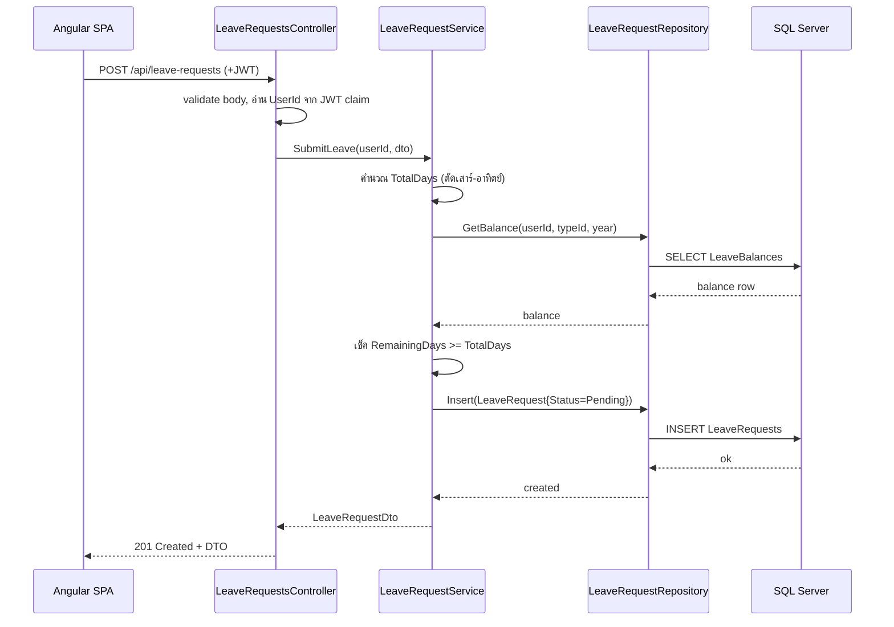

# System Design — Architecture

## 1. ภาพรวม

ระบบเป็น **3-tier layered architecture**: Angular SPA (frontend) คุยกับ .NET 8 Web API ผ่าน HTTP + JWT, ฝั่ง API แยกเป็น 3 ชั้น (Controller / Service / Repository) แล้วลงที่ SQL Server

```
┌─────────────────────────────┐
│        Angular SPA          │   หน้าจอ, ฟอร์ม, แนบ JWT ทุก request
└──────────────┬──────────────┘
               │  HTTPS + Bearer JWT
┌──────────────▼──────────────┐
│      Controller Layer       │   รับ request, validate input, map DTO, คืน HTTP status
├─────────────────────────────┤
│       Service Layer         │   business logic: ตัดวันลา, เช็คสิทธิ์, workflow, transaction
├─────────────────────────────┤
│      Repository Layer        │   data access ผ่าน EF Core (query/persist)
└──────────────┬──────────────┘
               │
┌──────────────▼──────────────┐
│         SQL Server          │
└─────────────────────────────┘
```

## 2. หน้าที่ของแต่ละชั้น (Separation of Concerns)

| ชั้น | รับผิดชอบ | **ห้าม**ทำ |
|---|---|---|
| **Controller** | รับ HTTP, อ่าน claim จาก JWT, validate รูปแบบ input, แปลง entity ↔ DTO, แมป exception → HTTP status | ห้ามมี business logic, ห้าม query DB ตรง |
| **Service** | กฎธุรกิจทั้งหมด (คำนวณ TotalDays, เช็คโควต้า, ตัดวันลา, เช็คสิทธิ์อนุมัติ, คุม transaction) | ห้ามรู้จัก HTTP / `HttpContext` |
| **Repository** | CRUD ผ่าน EF Core, query ที่ optimize ได้ | ห้ามมี business rule |

> เหตุผลที่แยกชั้น: เลียนแบบ codebase SaaS จริงของ Gofive ที่ใหญ่และจัดเป็นชั้น — แสดง separation of concerns และทำให้ test/ดูแลง่าย (mock repository เพื่อ unit test service ได้)

## 3. Request Lifecycle

ตัวอย่าง: พนักงานยื่นใบลา (`POST /api/leave-requests`)



## 4. Transaction Boundary

Transaction ถูกเปิด/ปิดที่ **Service Layer** (ไม่ใช่ controller, ไม่ใช่ repository) — เพราะ service คือที่ที่รู้ว่า operation ไหนต้อง atomic

- **การ approve** ต้องครอบเป็น transaction เดียว: เช็คโควต้า → เปลี่ยน `Status = Approved` → ตัด `UsedDays += TotalDays` (ถ้า status เปลี่ยนแต่โควต้าไม่ตัด = ข้อมูลพัง)
- การยื่น/ปฏิเสธ/ยกเลิก เป็น single write ไม่ต้องครอบหลายตาราง

ดูรายละเอียดใน [features/leave-approval.md](../features/leave-approval.md)

## 5. โครงโปรเจกต์

### Backend (`/api`)
```
LeaveManagement.Api/
├── Controllers/
│   ├── AuthController.cs
│   ├── LeaveRequestsController.cs
│   ├── LeaveBalancesController.cs
│   ├── LeaveTypesController.cs      # Admin
│   └── UsersController.cs           # Admin
├── Services/
│   ├── Interfaces/                  # ILeaveRequestService, IAuthService, ...
│   ├── LeaveRequestService.cs
│   ├── AuthService.cs
│   ├── LeaveTypeService.cs          # Admin
│   └── UserService.cs               # Admin
├── Repositories/
│   ├── Interfaces/
│   └── LeaveRequestRepository.cs
├── Models/
│   ├── Entities/                    # EF entities (ตรงกับ DB)
│   └── DTOs/                        # request/response objects
├── Data/
│   └── AppDbContext.cs
├── Migrations/
├── Helpers/                         # JWT, mapping
├── appsettings.json
└── Program.cs
```

### Frontend (`/web`)
```
src/app/
├── core/                 # auth guard, interceptor (แนบ token), services
├── features/
│   ├── auth/             # login
│   ├── leave-request/    # ฟอร์มยื่นลา + ประวัติ
│   ├── approval/         # หน้า manager อนุมัติ
│   └── dashboard/        # สรุปวันลา
├── shared/               # components ใช้ซ้ำ
└── models/               # interface ตรงกับ DTO
```

## 6. หลักการข้ามชั้น (cross-cutting)

- **DTO ทุกทาง**: controller รับ/คืนเป็น DTO เสมอ ไม่ส่ง EF entity ออก API (กัน over-posting และ leak โครง DB)
- **Validation 2 ระดับ**: รูปแบบ input (required, format) ที่ controller; business rule (โควต้าพอไหม, สิทธิ์อนุมัติ) ที่ service
- **Auth**: JWT interceptor ฝั่ง Angular แนบ `Authorization: Bearer <token>` ทุก request; ฝั่ง API มี middleware ตรวจ token + `[Authorize(Roles=...)]` ต่อ endpoint — ดู [design/security.md](security.md)
