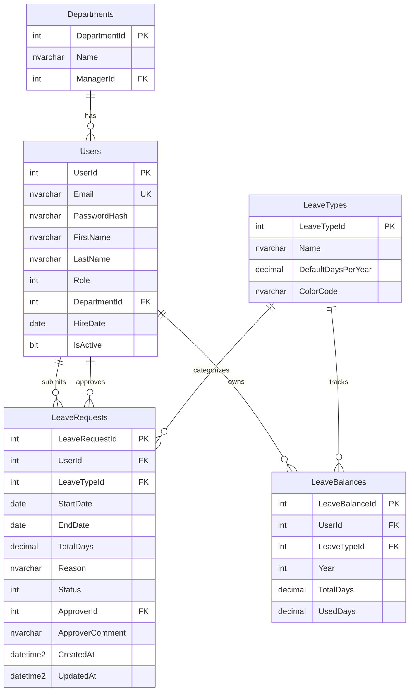

# System Design — Database

ฐานข้อมูล: **SQL Server** ผ่าน **Entity Framework Core** (code-first + migrations)

## 1. ER Diagram



## 2. Table Specifications

### Departments — แผนก (แต่ละแผนกมีหัวหน้า 1 คน)
| Column | Type | Note |
|---|---|---|
| DepartmentId | INT, PK, IDENTITY | |
| Name | NVARCHAR(100) | ไม่ซ้ำ |
| ManagerId | INT, FK→Users, NULL | หัวหน้าแผนก — **source of truth ของสิทธิ์อนุมัติ** |

### Users — พนักงานทุกคน (รวม manager และ admin)
| Column | Type | Note |
|---|---|---|
| UserId | INT, PK, IDENTITY | |
| Email | NVARCHAR(256), UNIQUE | ใช้ login |
| PasswordHash | NVARCHAR(MAX) | BCrypt |
| FirstName / LastName | NVARCHAR(100) | |
| Role | INT | 0=Employee, 1=Manager, 2=Admin — คุม access ระดับ endpoint/เมนู |
| DepartmentId | INT, FK→Departments | |
| HireDate | DATE | |
| IsActive | BIT | default 1; user ที่ปิดใช้งานห้าม login |

### LeaveTypes — ประเภทการลา (master data)
| Column | Type | Note |
|---|---|---|
| LeaveTypeId | INT, PK, IDENTITY | |
| Name | NVARCHAR(50) | ลาป่วย / ลากิจ / ลาพักร้อน |
| DefaultDaysPerYear | DECIMAL(5,1) | โควต้าเริ่มต้น/ปี |
| ColorCode | NVARCHAR(7) | สำหรับ UI เช่น `#FF5A5A` |

### LeaveBalances — โควต้าวันลาของแต่ละคน แยกตามปี + ประเภท
| Column | Type | Note |
|---|---|---|
| LeaveBalanceId | INT, PK, IDENTITY | |
| UserId | INT, FK→Users | |
| LeaveTypeId | INT, FK→LeaveTypes | |
| Year | INT | เช่น 2026 |
| TotalDays | DECIMAL(5,1) | โควต้าทั้งหมด |
| UsedDays | DECIMAL(5,1) | ใช้ไปแล้ว default 0 |

> `RemainingDays = TotalDays − UsedDays` คำนวณใน service **ไม่เก็บใน DB** เพื่อกัน data ไม่ตรงกัน
> UNIQUE `(UserId, LeaveTypeId, Year)` กันโควต้าซ้ำ

### LeaveRequests — ใบลา (transaction หลัก)
| Column | Type | Note |
|---|---|---|
| LeaveRequestId | INT, PK, IDENTITY | |
| UserId | INT, FK→Users | คนยื่น |
| LeaveTypeId | INT, FK→LeaveTypes | |
| StartDate / EndDate | DATE | |
| TotalDays | DECIMAL(5,1) | คำนวณตอนยื่น (ตัดเสาร์-อาทิตย์) |
| Reason | NVARCHAR(500) | |
| Status | INT | 0=Pending, 1=Approved, 2=Rejected, 3=Cancelled |
| ApproverId | INT, FK→Users, NULL | คนอนุมัติ |
| ApproverComment | NVARCHAR(500), NULL | |
| CreatedAt / UpdatedAt | DATETIME2 | default `SYSUTCDATETIME()` |

## 3. Relationships & Foreign Keys

| FK | จาก → ไป | หมายเหตุ |
|---|---|---|
| `Users.DepartmentId` | Users → Departments | พนักงานสังกัดแผนก |
| `Departments.ManagerId` | Departments → Users | หัวหน้าแผนก (circular ref กับ Users) |
| `LeaveBalances.UserId` | LeaveBalances → Users | |
| `LeaveBalances.LeaveTypeId` | LeaveBalances → LeaveTypes | |
| `LeaveRequests.UserId` | LeaveRequests → Users | ผู้ยื่น |
| `LeaveRequests.ApproverId` | LeaveRequests → Users | ผู้อนุมัติ (NULL จนกว่าจะถูกอนุมัติ/ปฏิเสธ) |
| `LeaveRequests.LeaveTypeId` | LeaveRequests → LeaveTypes | |

> **Circular FK**: `Users.DepartmentId → Departments` และ `Departments.ManagerId → Users` อ้างกันไปมา ใน DDL จึงต้องสร้าง `Users` ก่อน แล้วค่อย `ALTER TABLE Departments ADD CONSTRAINT FK_Dept_Manager` ทีหลัง

## 4. DDL (SQL Server)

```sql
CREATE TABLE Departments (
    DepartmentId INT IDENTITY(1,1) PRIMARY KEY,
    Name NVARCHAR(100) NOT NULL UNIQUE,
    ManagerId INT NULL
);

CREATE TABLE Users (
    UserId INT IDENTITY(1,1) PRIMARY KEY,
    Email NVARCHAR(256) NOT NULL UNIQUE,
    PasswordHash NVARCHAR(MAX) NOT NULL,
    FirstName NVARCHAR(100) NOT NULL,
    LastName NVARCHAR(100) NOT NULL,
    Role INT NOT NULL DEFAULT 0,
    DepartmentId INT NULL,
    HireDate DATE NOT NULL,
    IsActive BIT NOT NULL DEFAULT 1,
    CONSTRAINT FK_Users_Dept FOREIGN KEY (DepartmentId)
        REFERENCES Departments(DepartmentId)
);

ALTER TABLE Departments
    ADD CONSTRAINT FK_Dept_Manager FOREIGN KEY (ManagerId)
        REFERENCES Users(UserId);

CREATE TABLE LeaveTypes (
    LeaveTypeId INT IDENTITY(1,1) PRIMARY KEY,
    Name NVARCHAR(50) NOT NULL,
    DefaultDaysPerYear DECIMAL(5,1) NOT NULL,
    ColorCode NVARCHAR(7) NULL
);

CREATE TABLE LeaveBalances (
    LeaveBalanceId INT IDENTITY(1,1) PRIMARY KEY,
    UserId INT NOT NULL,
    LeaveTypeId INT NOT NULL,
    [Year] INT NOT NULL,
    TotalDays DECIMAL(5,1) NOT NULL,
    UsedDays DECIMAL(5,1) NOT NULL DEFAULT 0,
    CONSTRAINT FK_Balance_User FOREIGN KEY (UserId)
        REFERENCES Users(UserId),
    CONSTRAINT FK_Balance_Type FOREIGN KEY (LeaveTypeId)
        REFERENCES LeaveTypes(LeaveTypeId),
    CONSTRAINT UQ_Balance UNIQUE (UserId, LeaveTypeId, [Year])
);

CREATE TABLE LeaveRequests (
    LeaveRequestId INT IDENTITY(1,1) PRIMARY KEY,
    UserId INT NOT NULL,
    LeaveTypeId INT NOT NULL,
    StartDate DATE NOT NULL,
    EndDate DATE NOT NULL,
    TotalDays DECIMAL(5,1) NOT NULL,
    Reason NVARCHAR(500) NULL,
    Status INT NOT NULL DEFAULT 0,
    ApproverId INT NULL,
    ApproverComment NVARCHAR(500) NULL,
    CreatedAt DATETIME2 NOT NULL DEFAULT SYSUTCDATETIME(),
    UpdatedAt DATETIME2 NOT NULL DEFAULT SYSUTCDATETIME(),
    CONSTRAINT FK_Request_User FOREIGN KEY (UserId)
        REFERENCES Users(UserId),
    CONSTRAINT FK_Request_Type FOREIGN KEY (LeaveTypeId)
        REFERENCES LeaveTypes(LeaveTypeId),
    CONSTRAINT FK_Request_Approver FOREIGN KEY (ApproverId)
        REFERENCES Users(UserId),
    CONSTRAINT CK_Request_Dates CHECK (EndDate >= StartDate)
);

-- Indexes สำหรับ query ร้อน
CREATE INDEX IX_LeaveRequests_UserId ON LeaveRequests(UserId);   -- "คำขอของฉัน"
CREATE INDEX IX_LeaveRequests_Status ON LeaveRequests(Status);   -- "pending ของทีม"
```

## 5. Data Integrity — สรุปกลไกกันข้อมูลพัง

| กลไก | ที่ไหน | กันอะไร |
|---|---|---|
| UNIQUE `(UserId, LeaveTypeId, Year)` | LeaveBalances | โควต้าซ้ำต่อปี |
| CHECK `EndDate >= StartDate` | LeaveRequests | ช่วงวันลากลับหัว |
| UNIQUE `Email` | Users | อีเมลซ้ำ |
| คำนวณ RemainingDays ใน service | (ไม่เก็บ DB) | TotalDays/UsedDays/Remaining ไม่ตรงกัน |
| DB transaction ตอน approve | Service | status เปลี่ยนแต่โควต้าไม่ตัด |

## 6. Enums

**Role** — 0=Employee, 1=Manager, 2=Admin
**Status** — 0=Pending, 1=Approved, 2=Rejected, 3=Cancelled

## 7. Seed Data (เริ่มต้น)

```sql
INSERT INTO LeaveTypes (Name, DefaultDaysPerYear, ColorCode) VALUES
(N'ลาป่วย',     30, '#FF5A5A'),
(N'ลากิจ',      10, '#FFA500'),
(N'ลาพักร้อน',  10, '#4CAF50');
```

> เมื่อ seed user ตัวอย่าง ต้อง seed `LeaveBalances` ของ user เหล่านั้นด้วย (1 row ต่อ LeaveType ของปีปัจจุบัน) — ดู [features/leave-balance.md](../features/leave-balance.md)

## 8. LeaveBalances Lifecycle (สำคัญ)

โควต้าไม่ได้เกิดเอง — มี 2 จังหวะที่ถูกสร้าง:

1. **ตอนสร้าง user ใหม่** → service สร้าง `LeaveBalances` 1 row ต่อ `LeaveType` สำหรับปีปัจจุบัน (`TotalDays = LeaveType.DefaultDaysPerYear`, `UsedDays = 0`)
2. **ขึ้นปีใหม่ (year rollover)** → Admin เรียก `POST /api/leave-balances/generate?year=` สร้างโควต้าปีถัดไปให้ทุกคน — นโยบาย **reset ใหม่ทุกปี ไม่ carry-over**

รายละเอียดเต็มใน [features/leave-balance.md](../features/leave-balance.md) และ [features/admin.md](../features/admin.md)
