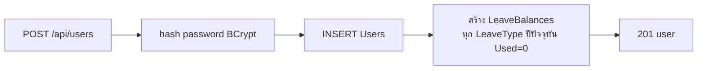

# Feature — Admin (จัดการ LeaveTypes / Users / โควต้าปีใหม่)

| | |
|---|---|
| **Actor** | Admin (`Role = 2`) |
| **Endpoints** | `POST/PUT /api/leave-types`, `POST/PUT /api/users`, `POST /api/leave-balances/generate` |
| **Controller / Service** | `LeaveTypesController`+`LeaveTypeService`, `UsersController`+`UserService` |
| **ตารางที่เกี่ยวข้อง** | `LeaveTypes`, `Users`, `Departments`, `LeaveBalances` |

## วัตถุประสงค์
งานตั้งค่า/ดูแลระบบที่ทำให้ feature อื่นมีข้อมูลพร้อมใช้ — ประเภทการลา, บัญชีผู้ใช้, และโควต้ารายปี

---

## 6.1 จัดการประเภทการลา (LeaveTypes)
- `POST /api/leave-types` — เพิ่มประเภท (`name`, `defaultDaysPerYear`, `colorCode`)
- `PUT /api/leave-types/{id}` — แก้ชื่อ / โควต้า default / สี

> การแก้ `DefaultDaysPerYear` **ไม่กระทบ** `LeaveBalances` ที่ generate ไปแล้ว — มีผลกับการ generate รอบถัดไปเท่านั้น

---

## 6.2 จัดการผู้ใช้ (Users)

### `POST /api/users` — สร้าง user

- hash password ด้วย BCrypt ก่อนเก็บ
- กำหนด `Role`, `DepartmentId`, `HireDate`
- **สร้าง `LeaveBalances` ให้อัตโนมัติ** (1 row/LeaveType, ปีปัจจุบัน) — ดู [leave-balance.md](leave-balance.md)

### `PUT /api/users/{id}` — แก้ user
- แก้ `Role` / `DepartmentId` / `IsActive`
- **ตั้งหัวหน้าแผนก**: กำหนด `Departments.ManagerId` ให้ชี้มาที่ user คนนี้ → ทำให้เขามีสิทธิ์อนุมัติของแผนกนั้น (ดู [design/security.md](../design/security.md))
- ปิดใช้งาน (`IsActive = 0`) → user นั้น login ไม่ได้

---

## 6.3 สร้างโควต้าปีใหม่ — `POST /api/leave-balances/generate?year=YYYY`
- สร้าง `LeaveBalances` ปี `YYYY` ให้ทุก active user (reset ใหม่ ไม่ carry-over)
- `UNIQUE (UserId, LeaveTypeId, Year)` กันสร้างซ้ำ
- รายละเอียดใน [leave-balance.md](leave-balance.md#52-lifecycle-ของ-leavebalances-สำคัญ)

---

## Business Rules
| กฎ | รายละเอียด |
|---|---|
| สร้าง user → สร้าง balances | อัตโนมัติทุก LeaveType ปีปัจจุบัน |
| Password | BCrypt เสมอ |
| ตั้ง Manager | ผ่าน `Departments.ManagerId` (เป็น source of truth ของสิทธิ์อนุมัติ) |
| ปิด user | `IsActive=0` → login ไม่ได้ |
| แก้ LeaveType | ไม่ย้อนแก้ balance เดิม |

## Error Cases
| กรณี | ผล |
|---|---|
| ไม่ใช่ Admin | 403 |
| email ซ้ำตอนสร้าง user | 409 (UNIQUE Email) |
| generate ปีที่มีอยู่แล้ว | row ที่ซ้ำไม่ถูกสร้าง (UNIQUE) |

## เชื่อมกับ feature อื่น
- Admin คือคนตั้ง `ManagerId` ที่ feature [leave-approval.md](leave-approval.md) ใช้ตัดสินสิทธิ์
- การสร้าง user/โควต้าเป็นต้นน้ำของ [leave-balance.md](leave-balance.md)
