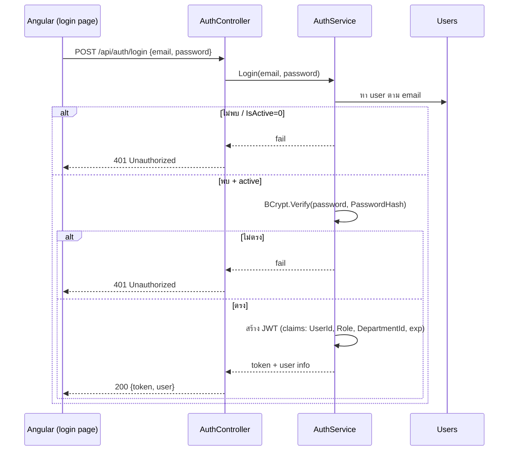

# Feature — Authentication

| | |
|---|---|
| **Actor** | ทุก role (Employee / Manager / Admin) |
| **Endpoint** | `POST /api/auth/login` (public) |
| **Controller / Service** | `AuthController` / `AuthService` |
| **ตารางที่เกี่ยวข้อง** | `Users` |

## วัตถุประสงค์
ยืนยันตัวตนด้วย email + password แล้วออก **JWT** ให้ client ใช้แนบกับทุก request ถัดไป

## Flow

## ขั้นตอน (Service Layer)
1. ค้นหา user จาก `Email` (unique)
2. ถ้าไม่พบ **หรือ** `IsActive = 0` → คืน 401 (ไม่บอกว่าผิดที่ email หรือ password — กัน account enumeration)
3. `BCrypt.Verify(input.password, user.PasswordHash)` — ไม่ตรง → 401
4. สร้าง JWT บรรจุ claim: `UserId`, `Role`, `DepartmentId`, `exp` (~60 นาที)
5. คืน `{ token, user{ userId, fullName, role, departmentId } }`

## Business Rules
- Password เก็บเป็น **BCrypt hash** เท่านั้น
- user ที่ `IsActive = 0` login ไม่ได้
- Token อายุ ~60 นาที, **ไม่มี refresh token** → หมดอายุ login ใหม่

## Validation
| field | กฎ |
|---|---|
| email | required, รูปแบบ email |
| password | required |

## Error Cases
| กรณี | ผล |
|---|---|
| email ไม่มีในระบบ | 401 (ข้อความรวม "email หรือ password ไม่ถูกต้อง") |
| password ผิด | 401 (ข้อความเดียวกัน) |
| user ถูกปิดใช้งาน | 401 |
| token หมดอายุ (ใน request อื่น) | 401 → ฝั่ง Angular เด้งไป login |

## เชื่อมกับ feature อื่น
JWT ที่ได้คือ input ของทุก feature: `UserId` ใช้ระบุ "ของฉัน", `Role` ใช้ผ่านด่าน endpoint, `DepartmentId` ใช้ช่วยกรองระดับแผนก — ดู [design/security.md](../design/security.md)
