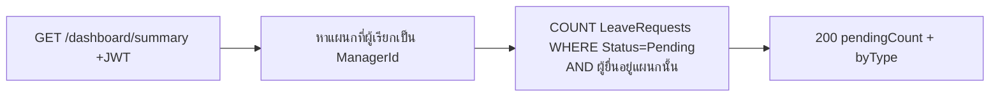

# Feature — Dashboard (สรุปสำหรับ Manager)

| | |
|---|---|
| **Actor** | Manager (ที่เป็น `Departments.ManagerId`) |
| **Endpoint** | `GET /api/dashboard/summary` |
| **Controller / Service** | `LeaveRequestsController` (หรือ `DashboardController`) / `LeaveRequestService` |
| **ตารางที่เกี่ยวข้อง** | `LeaveRequests`, `Users`, `Departments`, `LeaveTypes` |

## วัตถุประสงค์
ให้หัวหน้าเห็นภาพรวมงานที่ต้องทำในพริบตา — จำนวนคำขอที่รออนุมัติของแผนกตน

## Flow
1. อ่าน `UserId` จาก token → หาแผนกที่ผู้เรียกเป็น `Departments.ManagerId`
2. นับใบลา `Status = Pending` ของผู้ยื่นในแผนกนั้น
3. คืนยอดรวม + แยกตามประเภท (optional)



## Response (ตัวอย่าง)
```json
{
  "pendingCount": 3,
  "byType": [
    { "leaveType": "ลาป่วย", "count": 1 },
    { "leaveType": "ลาพักร้อน", "count": 2 }
  ]
}
```

## Business Rules
- นับเฉพาะ `Status = Pending`
- ขอบเขตข้อมูล = แผนกที่ผู้เรียกเป็น `ManagerId` เท่านั้น (เหมือน [leave-approval.md](leave-approval.md))
- ใช้ index `IX_LeaveRequests_Status` ช่วย query

## Error Cases
| กรณี | ผล |
|---|---|
| ไม่ใช่ Manager (role) | 403 |
| Manager ที่ไม่ได้เป็น ManagerId ของแผนกใด | 200 ด้วย `pendingCount: 0` |

## เชื่อมกับ feature อื่น
ตัวเลขที่เห็นบน dashboard คือ input ของ [leave-approval.md](leave-approval.md) — กดเข้าไปดู/อนุมัติต่อได้
