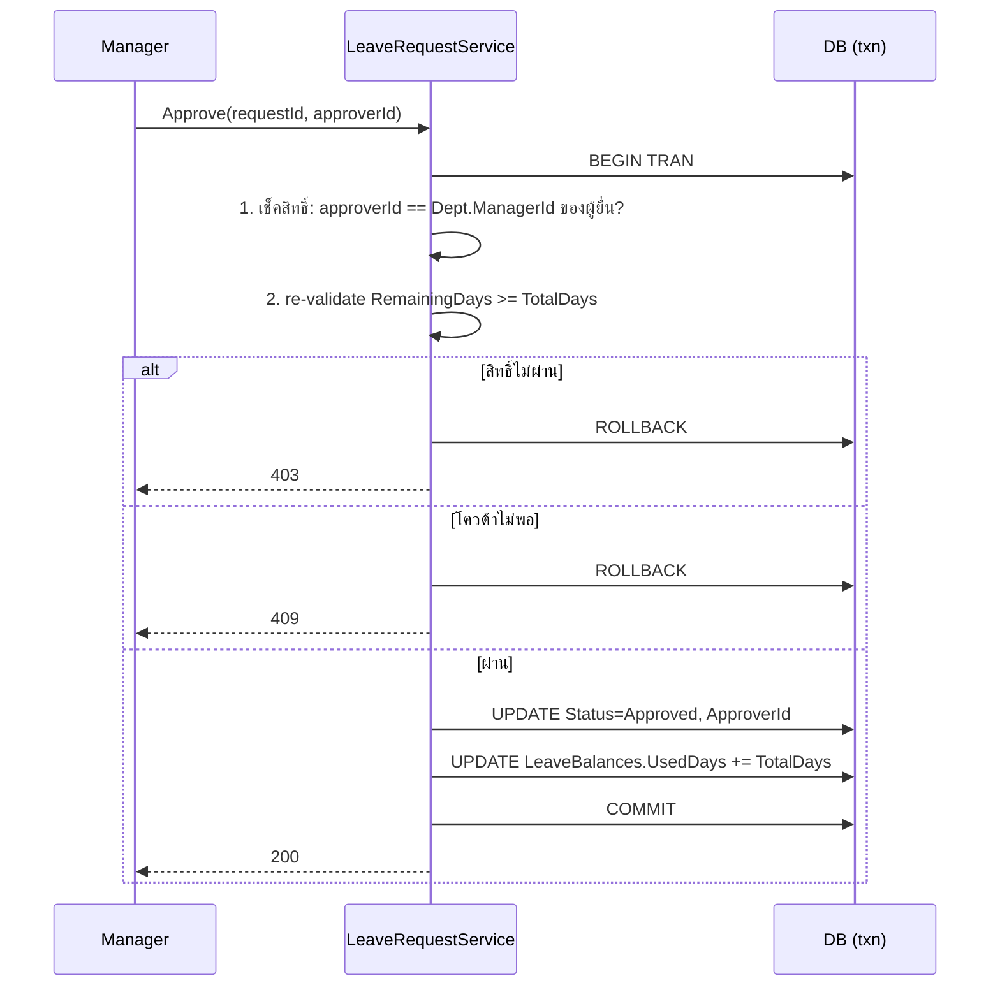
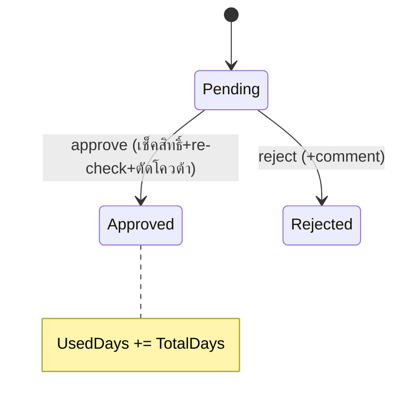

# Feature — Leave Approval (ดู pending / อนุมัติ / ปฏิเสธ)

| | |
|---|---|
| **Actor** | Manager (ที่เป็น `Departments.ManagerId` ของแผนก) |
| **Endpoints** | `GET /api/leave-requests/pending`, `PUT /api/leave-requests/{id}/approve`, `PUT /api/leave-requests/{id}/reject` |
| **Controller / Service** | `LeaveRequestsController` / `LeaveRequestService` |
| **ตารางที่เกี่ยวข้อง** | `LeaveRequests`, `LeaveBalances`, `Users`, `Departments` |

## วัตถุประสงค์
ให้หัวหน้าแผนกดูคำขอที่รออนุมัติของลูกทีม แล้วอนุมัติ (ตัดโควต้าอัตโนมัติ) หรือปฏิเสธพร้อม comment

> **หัวใจของระบบ** — feature นี้รวม approval workflow + business rule (ตัดโควต้า) + ความถูกต้องของข้อมูล (transaction + re-check)

---

## 4.1 ดูคำขอ pending — `GET /api/leave-requests/pending`
- คืนเฉพาะใบ `Status = Pending` ของผู้ยื่นที่อยู่ใน**แผนกที่ผู้เรียกเป็น `ManagerId`**
- ใช้ index `IX_LeaveRequests_Status`

---

## 4.2 อนุมัติ — `PUT /api/leave-requests/{id}/approve`

ทุกขั้น**อยู่ใน DB transaction เดียว**:

**ขั้นตอน (Service, ใน transaction):**
1. **เช็คสิทธิ์** — `approver.UserId == Departments.ManagerId` ของแผนกผู้ยื่น (ไม่ใช่แค่ Role=Manager)
2. **re-validate** `RemainingDays >= TotalDays` อีกครั้ง — ถ้าไม่พอ ปฏิเสธการอนุมัติ
3. เปลี่ยน `Status = Approved`, บันทึก `ApproverId`
4. ตัดโควต้า `UsedDays += TotalDays`

> **ทำไมต้อง re-check ข้อ 2** — ตอนยื่นเช็คโควต้าแค่ ณ ขณะนั้น ถ้าพนักงานยื่นหลายใบ Pending พร้อมกัน แต่ละใบพอดีโควต้าแต่รวมกันเกิน ถ้าไม่เช็คซ้ำตอนตัดจริงโควต้าจะติดลบ
> **ทำไมต้อง transaction** — กัน status เปลี่ยนแต่โควต้าไม่ตัด (atomicity)

---

## 4.3 ปฏิเสธ — `PUT /api/leave-requests/{id}/reject`
- เช็คสิทธิ์เหมือน approve (ต้องเป็น ManagerId ของแผนกผู้ยื่น)
- เปลี่ยน `Status = Rejected`, บันทึก `ApproverId` + `ApproverComment`
- **ไม่แตะโควต้า**

---

## State Machine (ฝั่ง Manager)

## Business Rules
| กฎ | รายละเอียด |
|---|---|
| สิทธิ์อนุมัติ | `approver == Departments.ManagerId` ของแผนกผู้ยื่นเท่านั้น |
| ตัดโควต้า | เกิดตอน approve เท่านั้น (`UsedDays += TotalDays`) |
| Atomicity | เช็ค + เปลี่ยน status + ตัดโควต้า อยู่ใน transaction เดียว |
| Re-check | ตรวจ RemainingDays ซ้ำตอน approve |
| ปฏิเสธ | ไม่กระทบโควต้า ต้องมี comment |

## Error Cases
| กรณี | ผล |
|---|---|
| ผู้เรียกไม่ใช่ ManagerId ของแผนกผู้ยื่น | 403 |
| ใบไม่ใช่ Status=Pending | 409 |
| โควต้าไม่พอตอน approve | 409 |

## เชื่อมกับ feature อื่น
- การตัด `UsedDays` กระทบ [leave-balance.md](leave-balance.md)
- ใครเป็น ManagerId กำหนดโดย Admin → [admin.md](admin.md)
- จำนวน pending แสดงใน [dashboard.md](dashboard.md)
