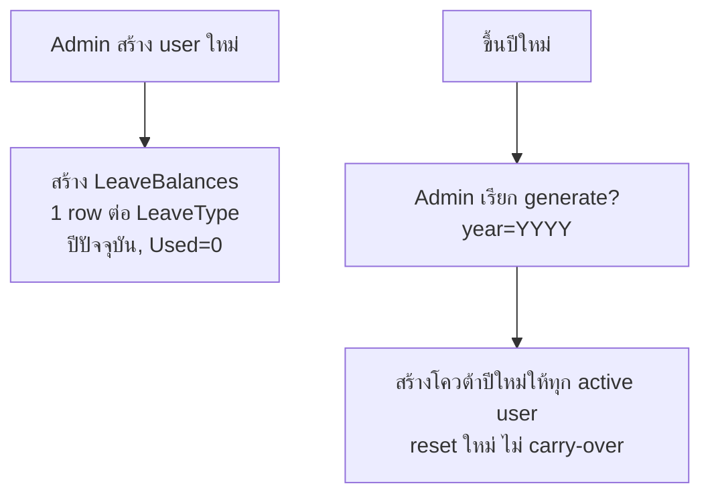

# Feature — Leave Balance (วันลาคงเหลือ + lifecycle โควต้า)

| | |
|---|---|
| **Actor** | Employee (ดูของตัวเอง), Admin (สร้าง/รีเซ็ตโควต้า) |
| **Endpoints** | `GET /api/leave-balances/me`, `POST /api/leave-balances/generate?year=` (Admin) |
| **Controller / Service** | `LeaveBalancesController` / `LeaveRequestService` หรือ service เฉพาะ |
| **ตารางที่เกี่ยวข้อง** | `LeaveBalances`, `LeaveTypes`, `Users` |

## วัตถุประสงค์
จัดการ "โควต้าวันลา" ของแต่ละคน — ทั้งการแสดงผลคงเหลือ และวงจรชีวิตของ row โควต้า (เกิดเมื่อไหร่ / รีเซ็ตเมื่อไหร่)

---

## 5.1 ดูวันลาคงเหลือ — `GET /api/leave-balances/me`
- คืนโควต้าทุกประเภทของ `UserId` (จาก token) สำหรับ**ปีปัจจุบัน**
- แต่ละรายการ: `total`, `used`, **`remaining = total − used`**

> `RemainingDays` **คำนวณใน service ไม่เก็บใน DB** — ป้องกัน total/used/remaining ไม่ตรงกัน (single source = total & used)

ตัวอย่าง response อยู่ใน [design/api-reference.md](../design/api-reference.md#2-get-apileave-balancesme)

---

## 5.2 Lifecycle ของ LeaveBalances (สำคัญ)

โควต้าไม่ได้เกิดเอง — ถูกสร้างใน 2 จังหวะ:

### ตอนสร้าง user ใหม่
- service สร้าง `LeaveBalances` 1 row ต่อ `LeaveType` ที่มีอยู่ สำหรับปีปัจจุบัน
- `TotalDays = LeaveType.DefaultDaysPerYear`, `UsedDays = 0`

### ขึ้นปีใหม่ (year rollover) — `POST /api/leave-balances/generate?year=YYYY` (Admin)
- สร้างโควต้าปี `YYYY` ให้ทุก user ที่ `IsActive = 1`
- **นโยบาย: reset ใหม่ทุกปี ไม่ carry-over** (วันลาเหลือปีก่อนไม่ทบมา) — เป็น scope decision
- `UNIQUE (UserId, LeaveTypeId, Year)` กันสร้างซ้ำ (เรียก generate ปีเดิมซ้ำจะไม่สร้างทับ/พัง)

---

## Business Rules
| กฎ | รายละเอียด |
|---|---|
| Remaining | คำนวณ (`total − used`) ไม่เก็บ DB |
| สร้างตอน user ใหม่ | 1 row/LeaveType, Used=0 |
| Rollover | reset ใหม่ ไม่ carry-over |
| กันซ้ำ | UNIQUE (UserId, LeaveTypeId, Year) |
| ตัดโควต้า | `UsedDays` เพิ่มเฉพาะตอน approve ใบลา (ดู [leave-approval.md](leave-approval.md)) |

## Edge Cases
| กรณี | พฤติกรรม |
|---|---|
| user ใหม่ระหว่างปี | ได้โควต้าเต็มของปีนั้น (ไม่ pro-rate — out of scope) |
| เพิ่ม LeaveType ใหม่หลัง generate แล้ว | balance ของ type ใหม่ยังไม่มีจนกว่าจะ generate รอบใหม่ |
| เรียก generate ปีเดิมซ้ำ | UNIQUE กันไว้ — ไม่สร้างทับ |

## เชื่อมกับ feature อื่น
- การ generate เป็นงานของ Admin → [admin.md](admin.md)
- การยื่น/อนุมัติอ่าน-เขียนค่านี้ → [leave-request.md](leave-request.md), [leave-approval.md](leave-approval.md)
