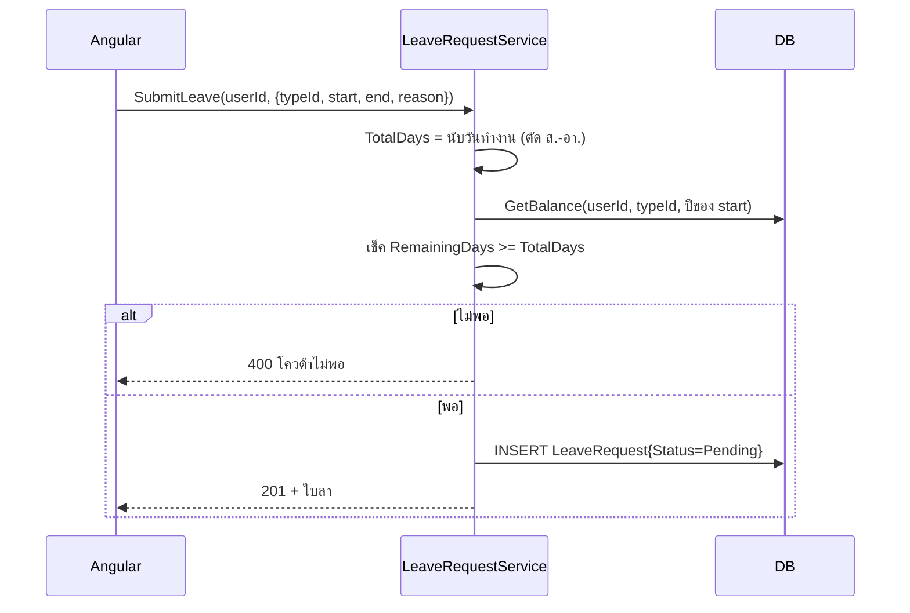
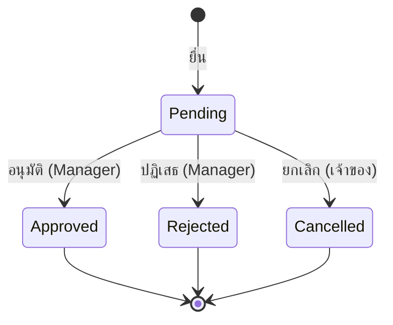

# Feature — Leave Request (ยื่น / ดูประวัติ / ยกเลิก)

| | |
|---|---|
| **Actor** | Employee (รวม Manager/Admin ที่ยื่นลาในฐานะพนักงาน) |
| **Endpoints** | `POST /api/leave-requests`, `GET /api/leave-requests/me`, `PUT /api/leave-requests/{id}/cancel` |
| **Controller / Service / Repository** | `LeaveRequestsController` / `LeaveRequestService` / `LeaveRequestRepository` |
| **ตารางที่เกี่ยวข้อง** | `LeaveRequests`, `LeaveBalances`, `LeaveTypes` |

## วัตถุประสงค์
ให้พนักงานยื่นใบลา ดูประวัติคำขอของตัวเอง และยกเลิกใบที่ยังไม่ถูกพิจารณา

---

## 3.1 ยื่นใบลา — `POST /api/leave-requests`

**ขั้นตอน (Service):**
1. คำนวณ `TotalDays` จาก `StartDate`–`EndDate` โดย**ตัดเสาร์–อาทิตย์ออก** (วันทำงานจริง)
2. ดึง `LeaveBalances` ของ (user, leaveType, ปีของ StartDate) แล้วคำนวณ `RemainingDays = TotalDays_balance − UsedDays`
3. ถ้า `RemainingDays < TotalDays_request` → reject ทันที (400)
4. สร้าง record `Status = Pending` — **ยังไม่ตัดโควต้า** (โควต้าตัดตอน approve เท่านั้น)

> ⚠️ การยื่นจะ**ไม่จอง**โควต้า — เช็คแค่ ณ ขณะยื่น การตัดจริงเกิดตอน approve ซึ่งมี re-check อีกชั้น (ดู [leave-approval.md](leave-approval.md))

**Validation:**
| field | กฎ |
|---|---|
| leaveTypeId | required, มีจริง |
| startDate / endDate | required, `endDate >= startDate` (มี CHECK ใน DB ด้วย) |
| reason | optional, ≤ 500 ตัวอักษร |

---

## 3.2 ดูประวัติของตัวเอง — `GET /api/leave-requests/me`
- คืนใบลาทุกสถานะของ `UserId` (จาก token) เรียงใหม่→เก่า
- รองรับ filter `?status=` (เช่นดูเฉพาะ Pending)
- ใช้ index `IX_LeaveRequests_UserId`

---

## 3.3 ยกเลิก — `PUT /api/leave-requests/{id}/cancel`
- ยกเลิกได้**เฉพาะใบของตัวเอง** และ **`Status = Pending`** เท่านั้น
- เปลี่ยน `Status = Cancelled` (3) — **ไม่แตะโควต้า** (เพราะ pending ยังไม่เคยตัด)

| กรณี | ผล |
|---|---|
| ใบของคนอื่น | 403 |
| Status ไม่ใช่ Pending | 409 |

> **Out of scope (ตั้งใจ):** ยกเลิกใบที่ `Approved` แล้ว + คืนโควต้า (`UsedDays -= TotalDays`) — ไม่ทำในเวอร์ชันนี้

---

## State ของใบลา (ฝั่ง Employee)

## Business Rules (สรุป)
- TotalDays = วันทำงาน (ตัดเสาร์-อาทิตย์)
- เช็คโควต้าตอนยื่น แต่ตัดจริงตอน approve
- ยกเลิกได้เฉพาะ Pending ของตัวเอง

## เชื่อมกับ feature อื่น
- การ approve/reject อยู่ใน [leave-approval.md](leave-approval.md)
- โควต้า/RemainingDays อยู่ใน [leave-balance.md](leave-balance.md)
